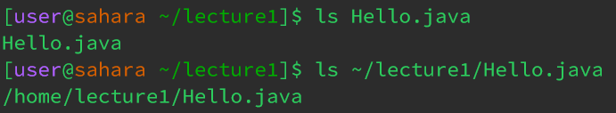

# Remote Access & FileSystem  
This week we covered three terminal commands 
`cd` , `ls` & `cat` 

## The `cd` command 
**Run with no arguments** 
 
*working directory was `home/lecture1/`* 
When run with no arguments `cd` changed the working directory to `home/`. It moves to the home directory regardless of the working directory 
This was not an error, although most programmers prefer using the command `cd ..` to move one directory backward  

**Run with directory as argument** 
 
*working directory was `home/`* 
When run with `lecture1` (a directory) as an argument, the `cd` command changed the working directory to `home/lecture1`. 
This was not an error. 

**Run with file as argument** 
 
*working directory was `home/lecture1`* 
When run with `Hello.java` as an argument, the `cd` command printed text explaining that `Hello.java` was not a directory. 
This is an error as the `cd` printed an error message and did not change the working directory. 

## The `ls` command 
**Run with no arguments** 
 
*working directory was `home/lecture1/`* 
When run with no argument the command printed text in the terminal of all of the file names in the working directory and printed other folders in blue. 
This is not an error. 

**Run with directory as argument** 
 
*working directory was `home/` 
When run with `lecture1` (a directory) as an argument, the `ls` command printed all of the file names within the directory `home/lecture1` and made all folders blue.  
This is not an error. 

**Run with file as argument** 
 
*working directory was `home/lecture1`* 
When run with `Hello.java` as an argument, the `ls` command printed `Hello.java` alone. However when run with the absolute path to `Hello.java` the command printed the path of the file. 
This is not an error. 

## The `cat` command 
**Run with no arguments** 
 
*working directory was `home/lecture1/`* 
When run with no argument the command waits for user input in the terminal, and then repeats the string given by the user. This continues until `cat` is deliberately stopped by using `cmd+d` or `ctrl+d`. 
This is not an error. 

**Run with directory as argument** 
 
*working directory was `home/`* 
When run with `lecture1` (a directory) as an argument, the `cat` command printed text explaining that `lecture1/` was a directory.  
This is an error as `cat` is used to read contents of files, however it can not for a directory . 

**Run with file as argument** 
 
*working directory was `home/lecture1/messages`* 
When run with `en-us.txt` as an argument, the `cat` command printed the contents of the `en-us.txt` file, which is "Hello World!". 
This is not an error. 
# Fin

