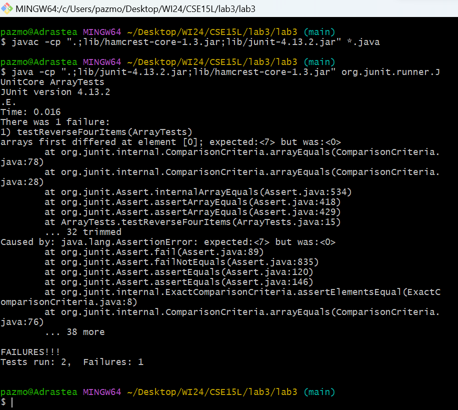

# Bugs & Commands <br>
This week we diagnosed different bugs, and learnt new bash commands<br>


## Part 1 - Bugs<br>
### Array Method Reversed<br>
This is the original Reversed method in ArrayExamples.java
```
static int[] reversed(int[] arr) {
    int[] newArray = new int[arr.length];
    for(int i = 0; i < arr.length; i += 1) {
      arr[i] = newArray[arr.length - i - 1];
    }
    return arr;
  }
```
**Failure Inducing Input for Reversed Function**<br>
This is a JUnit test that fails using above function implementation
```
@Test
  public void testReverseFourItems(){
    int[] input1 = {4,424,2,7};
    assertArrayEquals(new int[]{7,2,424,4}, ArrayExamples.reversed(input1));
  }
```
**Non Failure Inducing Input for Reversed Function**<br>
This is a JUnit test that does not fail using above function implementation
```
  @Test
  public void testReversed() {
    int[] input1 = { };
    assertArrayEquals(new int[]{ }, ArrayExamples.reversed(input1));
  }
```

**The Symptom**<br>
This is the output of running the above JUnit tests
<br>

**The Bug Fix** <br>
This is the previous code containing the Bug
```
static int[] reversed(int[] arr) {
    int[] newArray = new int[arr.length];
    for(int i = 0; i < arr.length; i += 1) {
      arr[i] = newArray[arr.length - i - 1];
    }
    return arr;
  }
```
Whearas, this is the new code that has fixed the bug
```
 static int[] reversed(int[] arr) {
    int[] newArray = new int[arr.length];
    for(int i = 0; i < arr.length; i += 1) {
      newArray[i] = arr[arr.length - i - 1];
    }
    return newArray;
  }
```
The difference between both functions is that I have changed the order of assignment within the for-loop on line four. Previously the code read from newArray and assigned value to arr, whearas now it reads from arr and assigns values to newArray. <br>
This fixes the issue as newArray is being returned and needs to be written to, rather than read from. 
## Part 2 - Researching  The `grep` Command<br>
### Ignoring Case Distinctions: `grep -i`<br>
**Example 1:**
```
pazmo@Adrastea MINGW64 ~/Desktop/WI24/CSE15L/docsearch/technical/biomed (main)
$ grep -i 'after' rr73.txt
            for co-culture within 4 hours after isolation.
            carefully. After repeated washing with Tris-buffered
            200 V. After electrophoresis, the gels were gently
            blue, 0.5% β-mercaptoethanol, 20% glycerol. After
```
In this example the grep command is searching for all matches of string 'after' in `rr73.txt`  within directory `\biomed` regardless of the capitalization of matching strings. Useful to find matches of string 'after' where the A may be capitalized. <br><br>
**Example 2:**<br>
```
pazmo@Adrastea MINGW64 ~/Desktop/WI24/CSE15L/docsearch/technical (main)
$ grep -i 'butcher' plos/*.txt
plos/journal.pbio.0020112.txt:        eventually to a change in the law, requiring all butchers in the UK handling cooked and raw
plos/journal.pbio.0020112.txt:        management principles that precedes it. The butcher John Barr (and his staff), whose shop
plos/journal.pbio.0020112.txt:        authoritative and blow-by-blow account shows failings not only in the butcher (who was,
plos/journal.pbio.0020112.txt:        incidentally, Scottish Master Butcher of the Year in 1996), but also in the inspectors who
```
In this example the grep command is searching for all matches of string 'butcher' in all `.txt` files within directory `\plos` regardless of the capitalization of found 'butcher' string. This is useful to find all matches of 'butcher' within the directory, regardless of capitalization. <br><br> Sources Used: https://en.wikibooks.org/wiki/Grep <br>

### Number of Matching Lines : `grep -c`<br>
**Example 1:**
```
pazmo@Adrastea MINGW64 ~/Desktop/WI24/CSE15L/docsearch/technical/911report (main)
$ grep -c 'Chess' *.txt
chapter-1.txt:0
chapter-10.txt:0
chapter-11.txt:0
chapter-12.txt:0
chapter-13.1.txt:0
chapter-13.2.txt:0
chapter-13.3.txt:0
chapter-13.4.txt:0
chapter-13.5.txt:0
chapter-2.txt:0
chapter-3.txt:0
chapter-5.txt:0
chapter-6.txt:0
chapter-7.txt:0
chapter-8.txt:0
chapter-9.txt:0
preface.txt:0
```
In this example the grep command is searching for all matches of string 'Chess' in all `.txt` files within `\911reports` and outputs the number of matches per file. Useful to identify a specific file containing a string within a large directory. <br><br>
**Example 2:**<br>
```
pazmo@Adrastea MINGW64 ~/Desktop/WI24/CSE15L/docsearch/technical/biomed (main)
$ grep -c 'hi' rr74.txt
36
```
In this example the grep command is searching for matches of string 'hi' in  `rr74.txt`  within directory `\biomed` and outputs the number of matches. This is useful to find number of matches within a large file as regular output may clutter terminal. <br><br> Sources Used: https://en.wikibooks.org/wiki/Grep <br>
### Only Exact Matches : `grep -w`<br>
**Example 1:**
```
pazmo@Adrastea MINGW64 ~/Desktop/WI24/CSE15L/docsearch/technical/biomed (main)
$ grep -w 'a' rr74.txt
        isoforms of NOS, is a vasodilator of the pulmonary
        circulation in many mammals. NO has been proposed as a
        however, possibly because of a decrease in cardiac output.
          breathing room air, and a 26-gauge needle was introduced
          percutaneously into the thorax via a subxyphloid
          were measured using a NO chemiluminescence analyzer
          increased following hypoxia, with a trend toward
          There was a modest increase in levels of NO metabolites
        understood because a hypoxia responsive element has not yet
        animals in our experiments are a different strain and were
        the present study have a higher rate of air exchange than
        The iNOS promoter contains a hypoxia responsive element,
        Mice deficient in iNOS do have a slight increase in right
        suggested as a compensatory vasodilator in the cerebral and
        to play a role in modulating tone in the pulmonary
        hypoxic, a relatively brief period of reoxygenation might
        NOS was downregulated, but did observe a decrease in
        In summary, we identified a unique pattern of NOS
```
In this example the grep command is searching for all exact matches of string 'a' in  `rr74.txt` within the directory `\biomed` and outputs all lines containing string 'a'. Useful when searching for specific short words that can often be substrings of larger words. <br><br>
**Example 2:**<br>
```
pazmo@Adrastea MINGW64 ~/Desktop/WI24/CSE15L/docsearch/technical/biomed (main)
$ grep -w 'peanut' *.txt
1471-2229-3-3.txt:        Cultivated peanut or groundnut (
1471-2229-3-3.txt:        cultivated peanut genotypes for various morphological,
1471-2229-3-3.txt:        cultivated peanut by molecular techniques. Although
1471-2229-3-3.txt:        microsatellites present in peanut [ 20 21 ] ,
1471-2229-3-3.txt:        microsatellites from the cultivated peanut genome; and (2)
1471-2229-3-3.txt:        microsatellites in a collection of peanut accessions with
1471-2229-3-3.txt:        peanut genotypes (see Table 1). The average number of
1471-2229-3-3.txt:        peanut. Using five such highly polymorphic markers, 24
1471-2229-3-3.txt:        showed). We believe that microsatellite markers in peanut
1471-2229-3-3.txt:        microsatellites in peanut.
1471-2229-3-3.txt:        List of peanut microsatellite (PM) markers.
1471-2229-3-3.txt:        in peanut [ 25 26 ] and thus genetic improvement through
1471-2229-3-3.txt:        saturate the existing peanut linkage map and to initiate
1471-2229-3-3.txt:        isolating protocols were established in peanut for
1471-2229-3-3.txt:        are the most abundant microsatellites in peanut genome.
1471-2229-3-3.txt:        peanut microsatellites [ 21 ] , in which five polymorphic
1471-2229-3-3.txt:        The rate of redundancy was high in peanut, while it was
1471-2229-3-3.txt:        development of microsatellites in peanut. Therefore, a
1471-2229-3-3.txt:        No correlation was found in cultivated peanut between
1471-2229-3-3.txt:        peanut genotypes studied. No polymorphism was detected with
1471-2229-3-3.txt:        realized before long in cultivated peanut.
1471-2229-3-3.txt:        microsatellite markers from the cultivated peanut. A
1471-2229-3-3.txt:        microsatellite markers is important not only for peanut
1471-2229-3-3.txt:        researchers but also for peanut industry as the paucity of
1471-2229-3-3.txt:        DNA markers in cultivated peanut has so far precluded
1471-2229-3-3.txt:        peanut accessions with diversified origins (see Table 1).
1477-7827-1-43.txt:          to 25 μg/ml in peanut oil. RU486 was administered as a
1477-7827-1-43.txt:          peanut oil on E16.5 and E17.5. Pups were born by natural
1477-7827-1-43.txt:        was administered in peanut oil following the same regimen
1477-7827-1-43.txt:        Thus, peanut oil alone is not responsible for the
```
In this example the grep command is searching for matches of string 'peanut' in  all `.txt` files  within directory `\biomed` and outputs the lines that exactly contain string 'peanut'. This is useful when the user is searching for specific case, grammar or words. <br><br> Sources Used: https://www.freecodecamp.org/news/grep-command-in-linux-usage-options-and-syntax-examples/ <br>

### Matches with Line Number : `grep -n`<br>
**Example 1:**
```
pazmo@Adrastea MINGW64 ~/Desktop/WI24/CSE15L/docsearch/technical/911report (main)
$ grep -n 'help' chapter-1.txt
248:    The NMCC would keep the FAA hijack coordinator up to date and help the FAA centers coordinate directly with the military. NORAD would receive tracking information for the hijacked aircraft either from joint use radar or from the relevant FAA air traffic control facility. Every attempt would be made to have the hijacked aircraft squawk 7500 to help NORAD track it.
282:    The Herndon Command Center immediately established a teleconference between Boston, New York, and Cleveland Centers so that Boston Center could help the others understand what was happening.
292:    FAA: Hi. Boston Center TMU [Traffic Management Unit], we have a problem here. We have a hijacked aircraft headed towards New York, and we need you guys to, we need someone to scramble some F-16s or something up there, help us out.
340:    While the Command Center was told about this "other aircraft" at 9:01, New York Center contacted New York terminal approach control and asked for help in locating United 175.
476:    At 9:46 the Command Center updated FAA headquarters that United 93 was now "twenty-nine minutes out of Washington, D.C." At 9:49, 13 minutes after Cleveland Center had asked about getting military help, the Command Center suggested that someone at headquarters should decide whether to request military assistance: FAA Headquarters: They're pulling Jeff away to go talk about United 93.
548:    Thus the military did not have 14 minutes to respond to American 77, as testimony to the Commission in May 2003 suggested. It had at most one or two minutes to react to the unidentified plane approaching Washington, and the fighters were in the wrong place to be able to help. They had been responding to a report about an aircraft that did not exist.
```
In this example the grep command is searching for all exact matches of string 'help' in  `chapter-1.txt` within the directory `\911report` and outputs all lines containing string 'help' alongside their appropriate line numbers in the file. This is useful when the file is long and users may need to access the lines containing these strings. <br><br>
**Example 2:**<br>
```
pazmo@Adrastea MINGW64 ~/Desktop/WI24/CSE15L/docsearch/technical/biomed (main)
$ grep -n 'specified' *.txt
1468-6708-3-10.txt:105:          Unless otherwise specified, all data for these
1468-6708-3-4.txt:52:          heart failure [ 3 ] . 'The primary pre-specified analysis
1468-6708-3-4.txt:529:        sensitivity analysis with a set of plausible, pre-specified
1471-2105-2-9.txt:54:            three ways: 1 a user-specified number of bases from
1471-2105-2-9.txt:61:            is specified, the user may adjust the stringency of the
1471-2105-2-9.txt:71:            specified by the user.
1471-2105-2-9.txt:160:            the user specified parameters for a record of the
1471-2105-3-16.txt:204:          specified document is a neighbor; and 3. WEIGHT, which is
1471-2105-3-16.txt:366:          than a specified threshold are identified. The OMIMIDs
1471-2105-3-16.txt:401:          whose PMIDs are not specified in OMIM. 54024 reference
1471-2105-3-18.txt:306:            generically to unspecified nonterminals.
1471-2105-3-2.txt:1772:            link to a new window that retrieves the specified entry
1471-2105-3-34.txt:44:        paths of a specified length through the interaction map
1471-2105-3-37.txt:504:          in the MASIA packet as a user specified feature.
1471-2105-4-24.txt:57:        no stage specified patients. For each subject a set of data
1471-2105-4-26.txt:543:          1 . The effect size δ was specified
1471-2105-4-26.txt:551:          n observations. For each specified
1471-2105-4-28.txt:76:          generation must bespecified. In the present study, we use
1471-2105-4-28.txt:202:          the nonlinear gene-gene interactions specifiedby these
1471-2105-4-28.txt:268:        specified for considering GPNN an improvement over the
1471-2105-4-28.txt:304:        (completely genetically-specified).
1471-2121-2-11.txt:494:          artifact but rather a function specified by the
1471-2121-3-13.txt:287:          cloning ring assay. In a specified length of time, cells
1471-2121-3-13.txt:640:          At the specified time points, chickens were euthanized
1471-2121-3-4.txt:589:          procedures [ 32 ] unless otherwise specified.
1471-213X-1-13.txt:34:        expressed by specified cells, activates Notch in
1471-213X-1-13.txt:59:        Newly-specified neurons may use Delta to signal to
1471-213X-1-13.txt:60:        unspecified neighboring precursor cells via Notch. Such
1471-213X-1-13.txt:81:        activity maintains cells in a proliferative, unspecified
1471-213X-1-13.txt:145:        neural precursors into specified neurons and glia of the
1471-213X-1-13.txt:217:          precursors and cells specified for neuronal development
1471-213X-1-13.txt:379:          deltaAmutant embryos have excess early-specified
1471-213X-1-13.txt:380:          neurons and fewer late-specified neurons and glia
1471-213X-1-13.txt:386:          types might be specified but some might arise ahead of
1471-213X-1-13.txt:395:          early-specified primary motor neurons and reduced numbers
1471-213X-1-13.txt:396:          of later-specified secondary motor neurons [ 28]. Our
1471-213X-1-13.txt:452:          signaling causes excess neural precursors to be specified
1471-213X-1-13.txt:479:          specified, post-mitotic cells use Delta signaling to
1471-213X-1-13.txt:485:          precursors express Delta and that those specified for
1471-213X-1-13.txt:496:          proliferative, unspecified state whereas those cells that
1471-213X-1-13.txt:537:          specified for that fate has passed, either because
1471-213X-1-13.txt:538:          neighboring precursors have been specified for other
1471-213X-1-13.txt:562:          In other words, early-born neurons are specified
1471-213X-1-13.txt:566:          cells specified for any particular fate.
1471-213X-1-13.txt:576:          specified cells. Specification of a particular cellular
1471-213X-1-13.txt:579:          zebrafish ventral neural precursors might be specified
1471-213X-1-13.txt:582:          exposure to Hh might be specified as primary motor
1471-213X-1-13.txt:587:          in an unspecified state for long enough to receive
1471-213X-1-13.txt:604:          neural precursor cells in an unspecified state and
1471-213X-1-13.txt:635:        specified neurons and glia.
1471-213X-1-3.txt:523:          albino rats, or of the adult angle of an unspecified
1471-213X-1-9.txt:670:          Ten μg (or less as specified) of each RNA sample was
1471-213X-3-3.txt:19:        prestalk and prespore cell types, sort in specified ways,
1471-2148-2-2.txt:515:        mis-specified. For a more detailed description of survival
1471-2148-3-7.txt:81:          analysis, the null hypothesis specified that nucleotide
1471-2156-2-17.txt:398:          cycles of 94°C for 5 s, the specified annealing
1471-2156-4-10.txt:769:          specified α level.
1471-2164-3-31.txt:583:          otherwise specified tumor total RNA, Universal Human
1471-2164-3-31.txt:628:          Three micrograms of aRNA (unless otherwise specified)
1471-2164-3-32.txt:500:          by PCC1 within the cutoff range specified by
1471-2164-3-32.txt:503:          cutoff range specified by
1471-2164-3-35.txt:554:          within a specified region about the center of the spot is
1471-2164-4-23.txt:463:        specified printing conditions. The synthesis and
1471-2164-4-4.txt:798:          specified value [ 11 ] . The Affymetrix MAS5 expression
1471-2172-3-10.txt:479:        specified and determined experimentally.
1471-2172-3-16.txt:572:          specified.
1471-2172-3-16.txt:586:          otherwise specified. Immunoblotting for the detection of
1471-2172-3-16.txt:604:          specified. Cells were harvested and washed twice with PBS
1471-2172-3-16.txt:668:          were used in the specified experiments.
1471-2172-3-16.txt:676:          sec (unless otherwise specified). Stimulated cells were
1471-2172-3-16.txt:699:          otherwise specified. The results were visualized and
1471-2180-2-35.txt:851:          aeration in LB at 37° until reaching a specified density
1471-2180-3-13.txt:437:            unspecified site in the
1471-2180-3-15.txt:142:          specified in Table 1denotes the start of the first repeat
1471-2202-2-20.txt:714:              specified level of performance.
1471-2288-2-10.txt:103:          criteria need to be specified in the meta-analysis
1471-2288-2-10.txt:105:          specified in a clinical protocol. The criteria should
1471-2288-2-10.txt:194:          needs to be specified in the meta-analysis protocol
1471-2288-2-10.txt:344:          and items for the quality score must be specified in the
1471-2288-2-10.txt:379:          the quality score, which must also be specified in the
1471-2288-2-10.txt:424:          specified. Since there is not much consistency with
1471-2288-3-8.txt:21:        missing-data mechanism with key parameters specified by the
1471-2288-3-8.txt:513:           , is specified by the investigator; the upper bound
1471-2288-3-8.txt:595:         = .10. We then specified ψ
1471-2288-3-8.txt:615:         , we specified a slightly larger value, ψ
1471-2288-3-9.txt:457:          1. Probability distributions are specified for the
1471-230X-2-17.txt:43:          with the comparator at the specified time point.
1471-2334-3-10.txt:209:          previous regulatory studies and was pre-specified in the
1471-2350-2-2.txt:409:          intervals, unless otherwise specified. Two-sided t-tests
1471-2350-3-1.txt:247:            prespecified criteria. Although the subtype of the
1471-2350-4-6.txt:439:          power for each specified value of p
1471-2369-3-10.txt:192:        cutting and piercing instrument," or E958.9 "unspecified
1471-2369-4-5.txt:74:          deviation unless otherwise specified. Univariate analysis
1471-2407-1-13.txt:232:          and other uterus not otherwise specified (hereafter
1471-2431-3-3.txt:126:          menarche at the midpoint (July 1) of the specified year.
1471-2431-3-4.txt:47:        breastfeeding information, specified according to source
1471-2431-3-4.txt:131:          food/fluid could not be specified, the end of exclusive
1471-2431-3-4.txt:418:            7). When adjusting for pre-specified confounders, use
1471-2431-3-5.txt:152:          not be specified, the end of exclusive breastfeeding was
1471-2458-1-9.txt:158:        786.2, pneumonia not otherwise specified (ICD9CM 486), and
1471-2458-2-21.txt:91:        were: unspecified items of clothing; belts, gloves,
1471-2458-2-21.txt:220:        these dermatitis cases, 34 reported unspecified dermatitis,
1471-2458-2-21.txt:225:        reported urticaria, 2 (3.1%) reported a non-specified
1471-2458-2-6.txt:261:          (unspecified) and alcohol, and who had an acute
1471-2474-3-3.txt:248:          failure point still has to be specified.
1472-6769-1-1.txt:546:          Non-specific binding was specified as the counts
1472-6793-2-4.txt:568:            except as specified above and were of the highest
1472-6823-3-1.txt:359:        specified causes of death were cardiac arrest of unknown
1472-6823-3-1.txt:443:        diabetes or have not specified by type. Therefore, reported
1472-6874-2-13.txt:292:          specified as a percentage. Setting the denominator to 0.2
1472-6882-1-10.txt:873:          human uses unless otherwise specified. Plants used to
1472-6882-2-10.txt:213:        tests specified that the EtOH group 
1472-6904-3-1.txt:430:          writedir is specified, then a text
1472-6947-3-5.txt:221:          specified in ISO-11179 that fully describes the CDE. TMA
1472-6947-3-5.txt:282:          be entirely specified by six semantic rules that can be
1472-6947-3-5.txt:437:            the order of the hierarchy is specified by underscore
1472-6947-3-8.txt:160:          biologic feature except those specified in their
1472-6947-3-8.txt:243:          Ontologies create logical rules between specified members
1475-4924-1-5.txt:484:          enriched among a specified set of genes can be calculated
1475-925X-2-10.txt:453:          to 50%, and greater than 50%, as specified by the
1476-0711-2-7.txt:397:        cannot be followed strictly within the specified time
1476-4598-1-5.txt:241:          cell, and 12 unspecified NSCLC undifferentiated or
1477-7827-1-13.txt:115:          All chemicals, except where specified otherwise, were
1477-7827-1-36.txt:154:          All chemicals, except where specified otherwise, were
1477-7827-1-46.txt:137:          All chemicals, except where specified otherwise, were
1478-1336-1-4.txt:99:        in the way that the ERs bind unspecified cofactors that
1478-1336-1-4.txt:335:          corepressor complex HDACs must play an unspecified role
ar615.txt:213:          specified time points divided by the elapsed time.
ar615.txt:371:          'high', 'medium' and 'low' [GAG] at week 3 (as specified
ar778.txt:436:          Blood was drawn before the infusion and at specified
bcr583.txt:62:          specified. Subjects were asked how often, on average,
bcr583.txt:63:          they had consumed the specified amount of each item. Nine
bcr583.txt:69:          value for the specified portion size, and summing the
cc1044.txt:294:        unspecified (27.3%) and hypoactive subtypes (26.2%) [ 35].
cc1529.txt:243:            prespecified and no type I error probability can be
cc303.txt:128:        unspecified). The patients most desired for this assessment
cvm-2-1-038.txt:243:        specified criterion of clinical improvement improvement on
cvm-2-1-038.txt:286:        Drug Administration approval process, have specified a
cvm-2-4-180.txt:78:          blinded core laboratory read the specified ECGs and
cvm-2-6-286.txt:147:        Pre-specified secondary endpoints were the frequency
```
In this example the grep command is searching for matches of string 'specified' in  all `.txt` files  within directory `\biomed` and outputs the files, lines and line numbers that contain string 'specified'. This is useful when the user is searching a large directory and requires access to these lines later. <br><br> Sources Used: https://www.freecodecamp.org/news/grep-command-in-linux-usage-options-and-syntax-examples/ <br>

# Fin