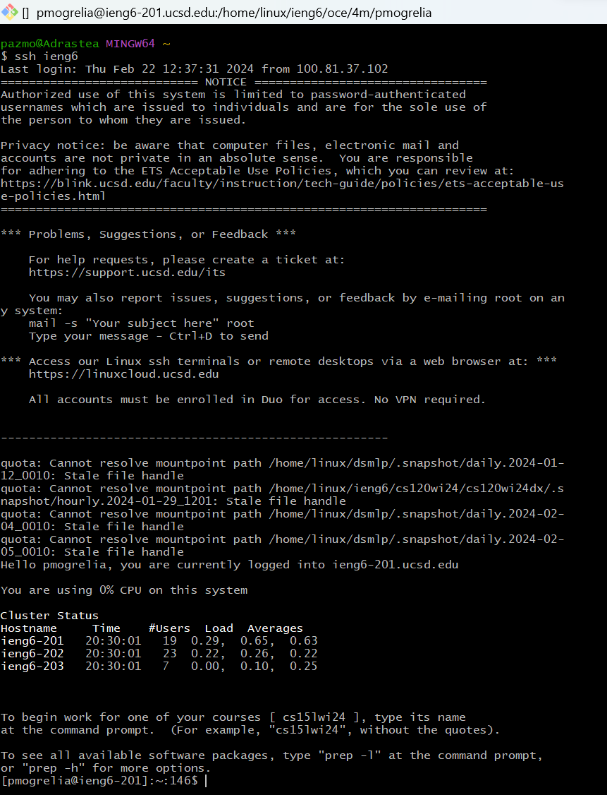
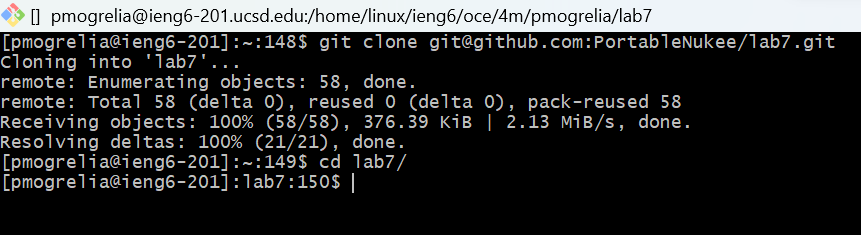
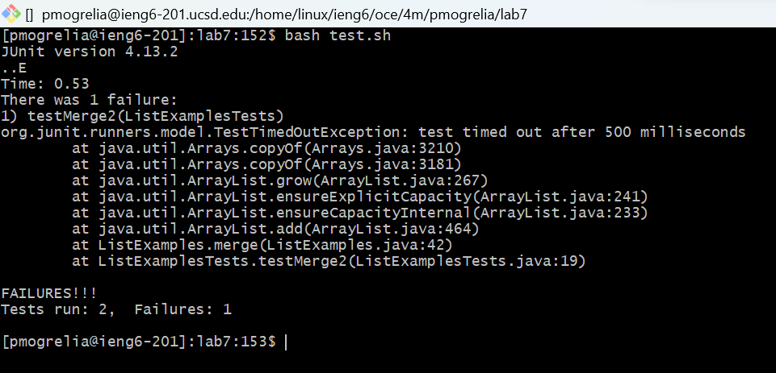
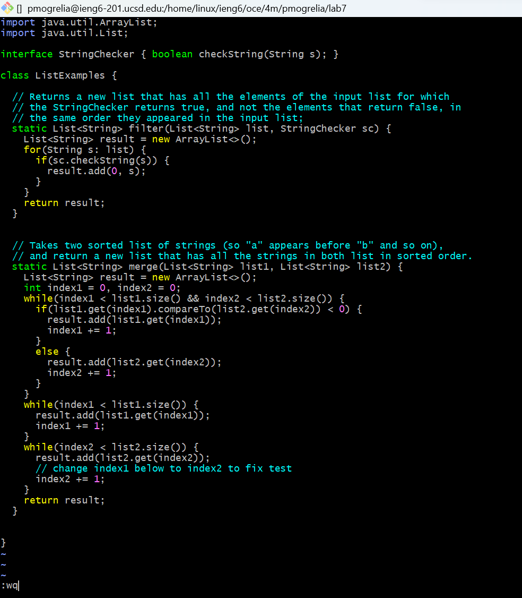
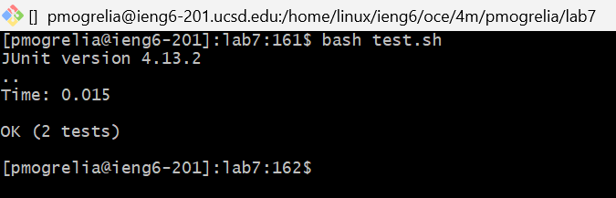
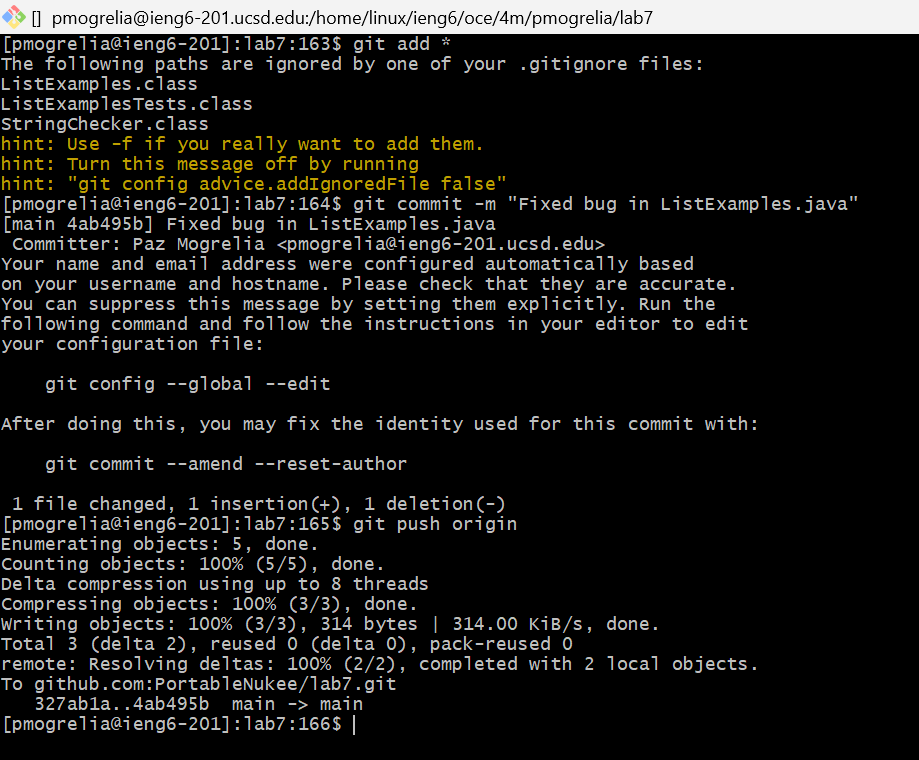

# Lab Report 4 - Vim  
This week we used the terminal and vim on our ieng6 system to solve an bug/error in a GitHub repository. 

## Step 1 - SSH into ieng6 
### Screenshot

### Explanation
**Commands Pressed**   `ssh ieng6 <enter>` 
**Reasoning**  `ssh` is the command used to remotely connect to other computers via the terminal, and `ieng6` is the destination system for which I already have SSH keys saved.  

## Step 2 - Clone Repository using SSH URL 
### Screenshot

### Explanation
**Commands Pressed**  `git clone git@github.com:PortableNukee/lab7.git <enter>`  `cd lab7/ <enter>` 
**Reasoning**  `git clone` is a terminal command used to clone repositories, whearas `git@github.com:PortableNukee/lab7.git` is the destination SSH url of the repository. Meanwhile `cd` is used to traverse through directories and `lab7` is the name of the directory of the newly cloned repository. 

## Step 3 - Run JUnit Test Cases 
### Screenshot

### Explanation
**Commands Pressed**  `bash t <tab> <enter>` 
**Reasoning** The `test.sh` file is a shell script that contains the neccesary commands to easily run the JUnit test cases for the repository. The command `bash` allows us to run these shell scripts, meanwhile `t <tab>` is used to autofill the full version of the file name `test.sh`. 

## Step 4 - Fix the Bug 
### Screenshot

### Explanation
**Commands Pressed**  `vim ListEx <tab> .java <enter>`  `:44 <enter> e i <del> 2 <esc> :wq <enter>` 
**Reasoning** The `vim` command runs a terminal-based text editor, and `ListEx <tab>` autofills `ListExamples` to which we add the `.java` extension and can open the `ListExamples.java` file within Vim after pressing `<enter>`.   Once within Vim the command `:44 <enter>` allows us to traverse our cursor to the 44th line, where the error lies. Then the command `e` moves the cursor to the end of the word `index1`. The commands `i <del> 2 <esc>` then in order, move Vim into insert mode, delete the previous character behind the cursor, insert the number 2, and `<esc>` removes the user from insert mode. Finally, the commands `:wq <enter>` save the changes made to the file, and close Vim. 

## Step 5 - Re-run the JUnit Test Cases 
### Screenshot

### Explanation
**Commands Pressed**  `<up><up><enter>` 
**Reasoning** The command `bash test.sh` is stored in the search history, and the commands `<up><up>` correctly access the command as it was run two shell commands ago. `<enter>` then runs the command `bash test.sh`. 

## Step 6 - Commit and Push to GitHub Repository 
### Screenshot

### Explanation
**Commands Pressed**  `git add * <enter>` 
`git commit -m "Fixed bug in ListExamples.java" <enter>`  
`git push origin <enter>` 
**Reasoning**  The `git add` command with parameter `*` takes all new changes that have occured in the directory (other than those specified by a .gitignore file) and moves the changed files to the staging area to be commited later. The `git commit` command actually saves all the edits within the staging area to the local clone of the repository, the `-m "Fixed bug in ListExamples.java"` parameter sets the mandatory message for a commit. Lastly, `git push origin` pushes/sends all new commits to the `origin` of this clone, which is the GitHub repository. Essentially updating the git repository hosted on GitHub with the commits we have made in our local cloned git repository. 

# Fin