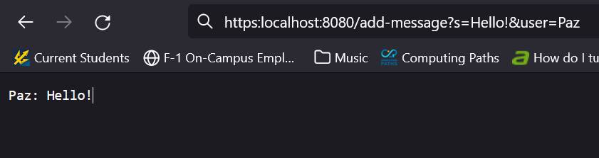
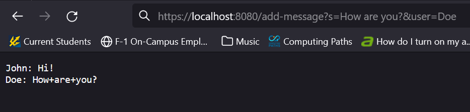
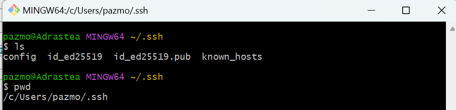
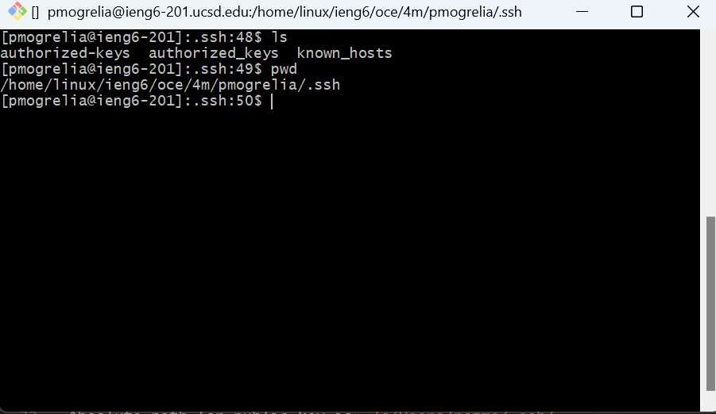
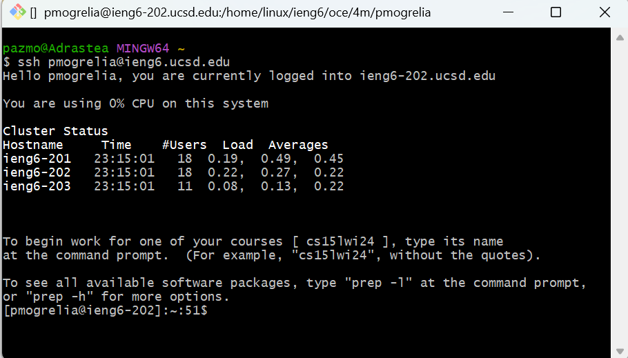

# Servers & SSH Keys <br>
This week we made web servers using Java & Created SSH keys to seamlessly SSH into school systems<br>


# Part One: Chat Server<br>
I created a chat server using Java that can update a chat history string when the following path and query is given. <br>
`/add-message?s=<string>&user=<string>`<br>
This is the code of `ChatServer.java`<br>
```
import java.io.IOException;
import java.net.URI;

class Handler implements URLHandler {
    // The one bit of state on the server: a number that will be manipulated by
    // various requests.
    String main = "";

    public String handleRequest(URI url) {
        if (url.getPath().equals("/")) {
            return main;
        } else if (url.getPath().equals("/add-message")) {
            if (url.getQuery().contains("&")) {
                String[] parameters = url.getQuery().split("&");
                String[] uname = parameters[1].split("=");
                String[] message = parameters[0].split("=");
                main += uname[1] + ": " + message[1] + "\n";
                return main;
             
            }
            
        }
        return main;
    }
}

class ChatServer {
    public static void main(String[] args) throws IOException {
        if(args.length == 0){
            System.out.println("Missing port number! Try any number between 1024 to 49151");
            return;
        }

        int port = Integer.parseInt(args[0]);

        Server.start(port, new Handler());
    }
}
```

# Example 1:
<br>

 <br>
The function `public String handleRequest(URI url)` is called in this example.
The relevant arguments in this method is the url field `https:localhost:8080/add-message?s=Hello!&user=Paz` <br>
Relevant fields of the class is the main string, which in this example begins as an empty string. <br>
From this specific request the value of the main string is changed. <br>
This is because from the url the string after `user=` and `s=` are concatenated to the main string on a new line.<br>
Main string becomes `"Paz: Hello!"`

# Example 2:
<br><br>
The function `public String handleRequest(URI url)` is called in this example.
The relevant arguments in this method is the url field `https:localhost:8080/add-message?s=How are you?&user=Doe` <br>
Relevant fields of the class is the main string, which in this example begins as `"John: Hi! \n"`. <br>
From this specific request the value of the main string is changed. <br>
This is because from the url the string after `user=` and `s=` are concatenated to the main string on a new line.<br>
Main string becomes `"John: Hi! \n Doe: How+are+you?"`

# Part 2: SSH Keys
Private SSH Keys <br>
<br>
Absolute path for private key is `/c/Users/pazmo/.ssh/id_ed25519`<br><br>
Public SSH Keys
<br>
Absolute path for public key is `/home/linux/ieng6/oce/4m/pmogrelia/.ssh/authorized-keys`<br><br>
Terminal Login Screenshot


# Part 3
This week in lab I learned about public key encryption, and that it is easier to implement than I had previously imagined. Furthermore, I learned how to configure and setup a git bash terminal on my windows computer within vscode.
# Fin


